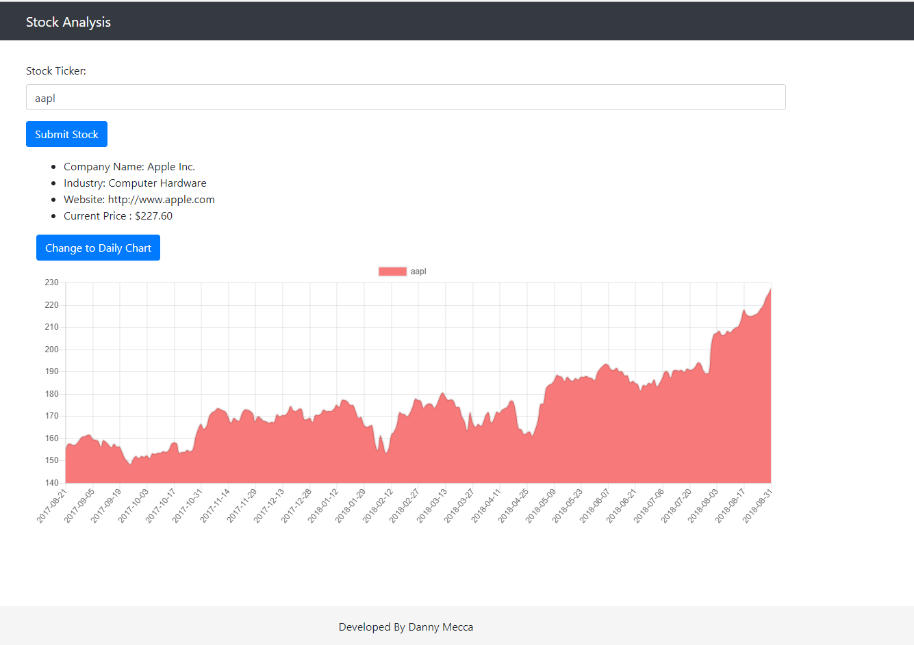

# Stock Analysis 
Simple app to analyze certain stocks. 

# Stock data 
Stock data is coming from IEX trading. Below is link to documentation. 
- https://iextrading.com/developer/docs/ 

# Usage
- The easiest way to start is to clone the repository. 
```bash
# Get the latest snapshot
git clone https://github.com/mecca2/simple-stock-analysis myproject

# Change directory
cd myproject

# Install NPM dependencies
npm install

# Then simply start your app
node app.js

# If nodemon is installed you can run by just using the following command. 
nodemon 

# Site will then run on port 3000. Site can be accessed from the following url. 
http://localhost:3000/ 
``` 

# Screenshot: 
- Example request for stock data on appl. 
	- 


# To Do 
- Currently using chart js want to move to am charts 
	- https://www.amcharts.com/stock-chart/ 
- Update so user can select time interval 
- Calculate additional stats on stocks: 
	- Number of high / low days in a year 
	- How stock compares to peers in industry (High / low percentile)
